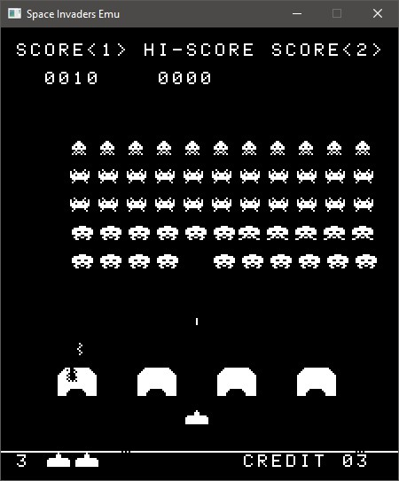

=======================
Space Invaders Emulator
=======================
Space Invaders arcade game emulator written in C.

Works only for Windows. The Windows API is used to implement display, audio 
(XAudio2) and user inputs reading.

Still not perfect as the game occasionally crashes. But it was made for learning
purposes and can be improved later, so I am happy with it.

The rest of this README outlines how the different components of this emulator 
were implemented.

CPU
===

Instruction functions
---------------------
Every instructions received by the CPU have their functionalities implemented in 
the form of a function. 

They are all listed under `CPU/Instructions`, grouped by their respective 
functionality. `Arithmetic.c` groups all arithmetic-related instructions (`ADD`,
`SUB` ...) and so on.

These functions may take in one or multiple arguments to represent all possible
instructions. For example, the `ADD` instruction's function takes in one 
argument to identify which register's value should be added to the accumulator.
So `ADD(REG_B)` is the equivalent of `ADD B`.

Instructions list
-----------------
A struct (`Instruction8080`) used to represent an instruction is declared in 
`CPU/Instructions.h`. This struct contains all necessary information on the 
instruction it represents; its mnemonic, size, function pointer and how many 
arguments its function takes.

An array of these structs is used to represent every single instruction used by 
the CPU, ordered by their opcodes (from 0x00 to 0xff).
This array is a static variable belonging to the file `CPU/Instructions/List.c`.
Its elements are accessed by calling `Get_Instruction`, which just returns the 
instruction at the given index, which ends up being its opcode.

Instructions interpreting
-------------------------
The CPU's main function, `Interpret_Instruction` then simply takes a given 
fetched instruction and calls its function with the appropriate arguments.

Memory
======
Memory used by the emulator is allocated and accessed through `Memory/Memory.c`.
The Space Invaders ROM is loaded in memory, then more memory is allocated for 
the work/video RAM. This is made accessible with the `Get_Mem_Byte_P` function,
which returns a pointer to the value located at the given offset.

IO
==
The CPU's instructions `IN` and `OUT` are meant to communicate with external 
hardware. This module is meant to bridge the emulated external hardware and the 
CPU by exposing two easy-to-use functions to the CPU, `Read_Input_Port` which 
returns the value at the given port number, and `Write_Input_Port` which sends a 
value to the given port number.

Internally, a function is defined for each of the input and output ports. Every
call of `Read/Write_Input_Port` is routed to one of them. They finally call 
appropriate functions from the emulated hardware (controls, config DIP switch, 
hardware shift register & sound player) which is all defined in the `Devices` 
directory.

Display
=======
The Windows API is used for the display. A window is firstly created, and then 
a bitmap is created using the CPU's emulated memory's VRAM. 

An interrupt is sent to the CPU 120 times per second, and the contents of the 
VRAM are drawn to the screen every 2nd interrupt (60 times per second).

The contents of the VRAM are copied to another buffer which is then inverted and
finally displayed. This is due to the Windows API reading the bitmap bits 
in the opposite direction to how they were previously read.

The window's display is also rotated 90 degrees clockwise, so the display is
right-side up (the original monitor was rotated in the cabinet 90 degrees 
counter-clockwise).
